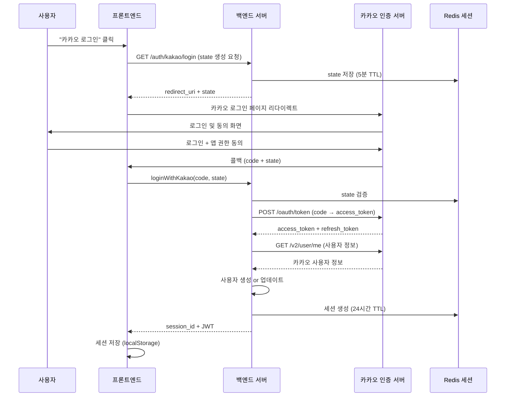

# 카카오 OAuth 2.0 로그인 시스템 설계 (엔터프라이즈급)

## 📋 개요

Foodie 플랫폼에 카카오 OAuth 2.0 기반 소셜 로그인을 엔터프라이즈 수준으로 구현합니다.

### 핵심 요구사항
- ✅ **단일 로그인 방식**: 카카오 OAuth만 지원
- ✅ **보안**: CSRF 방어, 토큰 암호화, Rate Limiting
- ✅ **확장성**: Redis 기반 세션 관리
- ✅ **신뢰성**: Refresh Token 자동 갱신
- ✅ **감사 로그**: 모든 인증 이벤트 기록

---

## 🔐 OAuth 2.0 Authorization Code Flow



---

## 🗄️ 데이터베이스 설계

### **1. oauth_providers 테이블**
카카오 OAuth 연결 정보를 저장합니다.

```sql
CREATE TABLE oauth_providers (
    id INTEGER PRIMARY KEY AUTOINCREMENT,
    user_id INTEGER NOT NULL,
    provider VARCHAR(20) NOT NULL DEFAULT 'kakao',
    provider_user_id VARCHAR(255) NOT NULL,  -- 카카오 회원번호
    access_token TEXT,  -- 암호화 저장
    refresh_token TEXT,  -- 암호화 저장
    token_expires_at DATETIME,
    profile_data TEXT,  -- JSON: 카카오 프로필 정보
    created_at DATETIME DEFAULT CURRENT_TIMESTAMP,
    updated_at DATETIME DEFAULT CURRENT_TIMESTAMP,

    FOREIGN KEY (user_id) REFERENCES users(id) ON DELETE CASCADE,
    UNIQUE(provider, provider_user_id)
);

CREATE INDEX idx_oauth_user_id ON oauth_providers(user_id);
CREATE INDEX idx_oauth_provider_user ON oauth_providers(provider, provider_user_id);
```

### **2. oauth_states 테이블 (Redis로 대체 가능)**
CSRF 방어용 state 파라미터를 임시 저장합니다.

```sql
-- Redis 키: oauth:state:{state}
-- 값: { "user_ip": "127.0.0.1", "created_at": "2025-11-01T12:00:00Z" }
-- TTL: 300초 (5분)
```

### **3. users 테이블 수정**
기존 `email`, `password_hash` 필드를 선택사항으로 변경합니다.

```sql
ALTER TABLE users MODIFY COLUMN email VARCHAR(255) NULL;
ALTER TABLE users MODIFY COLUMN password_hash VARCHAR(255) NULL;
ALTER TABLE users ADD COLUMN login_method VARCHAR(20) DEFAULT 'kakao';  -- 'kakao' only
```

### **4. audit_logs 테이블 (신규)**
모든 인증 이벤트를 기록합니다.

```sql
CREATE TABLE audit_logs (
    id INTEGER PRIMARY KEY AUTOINCREMENT,
    user_id INTEGER,
    event_type VARCHAR(50) NOT NULL,  -- 'kakao_login', 'logout', 'token_refresh'
    ip_address VARCHAR(45),
    user_agent TEXT,
    metadata TEXT,  -- JSON: 추가 정보
    status VARCHAR(20) NOT NULL,  -- 'success', 'failure'
    error_message TEXT,
    created_at DATETIME DEFAULT CURRENT_TIMESTAMP,

    FOREIGN KEY (user_id) REFERENCES users(id) ON DELETE SET NULL
);

CREATE INDEX idx_audit_user ON audit_logs(user_id, created_at DESC);
CREATE INDEX idx_audit_event ON audit_logs(event_type, created_at DESC);
```

---

## 🔧 백엔드 구현

### **디렉토리 구조**

```
backend/src/
├── auth/
│   ├── mod.rs                   # 기존
│   ├── jwt.rs                   # 기존
│   ├── oauth/
│   │   ├── mod.rs               # OAuth 공통 로직
│   │   ├── kakao.rs             # 카카오 OAuth 클라이언트
│   │   └── state_manager.rs    # State CSRF 검증
│   └── audit.rs                 # 감사 로그
├── models/
│   ├── oauth_provider.rs        # OAuthProvider 모델
│   └── audit_log.rs             # AuditLog 모델
└── graphql/
    └── mutations/
        └── kakao_auth.rs        # loginWithKakao mutation
```

### **주요 API**

#### **1. Kakao OAuth 클라이언트**

```rust
// backend/src/auth/oauth/kakao.rs

use reqwest::Client;
use serde::{Deserialize, Serialize};

#[derive(Debug, Serialize)]
pub struct KakaoTokenRequest {
    grant_type: String,
    client_id: String,
    redirect_uri: String,
    code: String,
    client_secret: Option<String>,
}

#[derive(Debug, Deserialize)]
pub struct KakaoTokenResponse {
    pub access_token: String,
    pub token_type: String,
    pub refresh_token: Option<String>,
    pub expires_in: i64,
    pub refresh_token_expires_in: Option<i64>,
}

#[derive(Debug, Deserialize)]
pub struct KakaoUserInfo {
    pub id: i64,
    pub connected_at: String,
    pub kakao_account: Option<KakaoAccount>,
    pub properties: Option<KakaoProperties>,
}

#[derive(Debug, Deserialize)]
pub struct KakaoAccount {
    pub profile: Option<KakaoProfile>,
    pub email: Option<String>,
    pub age_range: Option<String>,
    pub birthday: Option<String>,
    pub gender: Option<String>,
}

#[derive(Debug, Deserialize)]
pub struct KakaoProfile {
    pub nickname: Option<String>,
    pub profile_image_url: Option<String>,
    pub thumbnail_image_url: Option<String>,
}

#[derive(Debug, Deserialize)]
pub struct KakaoProperties {
    pub nickname: Option<String>,
    pub profile_image: Option<String>,
}

pub struct KakaoOAuthClient {
    client: Client,
    client_id: String,
    client_secret: Option<String>,
    redirect_uri: String,
}

impl KakaoOAuthClient {
    pub fn new(client_id: String, client_secret: Option<String>, redirect_uri: String) -> Self {
        Self {
            client: Client::new(),
            client_id,
            client_secret,
            redirect_uri,
        }
    }

    /// Authorization Code를 Access Token으로 교환
    pub async fn exchange_code(&self, code: &str) -> Result<KakaoTokenResponse, Box<dyn std::error::Error>> {
        let params = KakaoTokenRequest {
            grant_type: "authorization_code".to_string(),
            client_id: self.client_id.clone(),
            redirect_uri: self.redirect_uri.clone(),
            code: code.to_string(),
            client_secret: self.client_secret.clone(),
        };

        let response = self.client
            .post("https://kauth.kakao.com/oauth/token")
            .form(&params)
            .send()
            .await?
            .json::<KakaoTokenResponse>()
            .await?;

        Ok(response)
    }

    /// Access Token으로 사용자 정보 가져오기
    pub async fn get_user_info(&self, access_token: &str) -> Result<KakaoUserInfo, Box<dyn std::error::Error>> {
        let response = self.client
            .get("https://kapi.kakao.com/v2/user/me")
            .bearer_auth(access_token)
            .send()
            .await?
            .json::<KakaoUserInfo>()
            .await?;

        Ok(response)
    }

    /// Refresh Token으로 Access Token 갱신
    pub async fn refresh_token(&self, refresh_token: &str) -> Result<KakaoTokenResponse, Box<dyn std::error::Error>> {
        let params = [
            ("grant_type", "refresh_token"),
            ("client_id", &self.client_id),
            ("refresh_token", refresh_token),
        ];

        let response = self.client
            .post("https://kauth.kakao.com/oauth/token")
            .form(&params)
            .send()
            .await?
            .json::<KakaoTokenResponse>()
            .await?;

        Ok(response)
    }
}
```

#### **2. GraphQL Mutation**

```graphql
type Mutation {
  # Step 1: 카카오 로그인 URL 생성 (state 발급)
  generateKakaoLoginUrl: KakaoLoginUrl!

  # Step 2: 카카오 콜백 처리 (code + state → session)
  loginWithKakao(input: KakaoLoginInput!): AuthPayload!

  # 토큰 갱신 (자동)
  refreshKakaoToken: Boolean!
}

input KakaoLoginInput {
  code: String!         # 카카오 Authorization Code
  state: String!        # CSRF 방어용 state
}

type KakaoLoginUrl {
  url: String!          # 카카오 로그인 페이지 URL
  state: String!        # State 파라미터 (프론트엔드에서 보관)
}

type AuthPayload {
  sessionId: String!
  token: String!        # JWT (하위 호환)
  user: User!
  isNewUser: Boolean!   # 신규 가입 여부
}
```

---

## 🎨 프론트엔드 구현

### **1. 카카오 로그인 버튼**

```tsx
// src/components/auth/KakaoLoginButton.tsx

import { useMutation } from '@apollo/client';
import { GENERATE_KAKAO_LOGIN_URL } from '@/lib/graphql/mutations';

export function KakaoLoginButton() {
  const [generateUrl] = useMutation(GENERATE_KAKAO_LOGIN_URL);

  const handleKakaoLogin = async () => {
    try {
      const { data } = await generateUrl();
      const { url, state } = data.generateKakaoLoginUrl;

      // State를 세션 스토리지에 저장 (CSRF 방어)
      sessionStorage.setItem('kakao_oauth_state', state);

      // 카카오 로그인 페이지로 리다이렉트
      window.location.href = url;
    } catch (error) {
      console.error('카카오 로그인 URL 생성 실패:', error);
    }
  };

  return (
    <button
      onClick={handleKakaoLogin}
      className="kakao-login-btn"
      aria-label="카카오 로그인"
    >
      
      카카오 로그인
    </button>
  );
}
```

### **2. OAuth 콜백 처리**

```tsx
// src/pages/auth/KakaoCallbackPage.tsx

import { useEffect } from 'react';
import { useMutation } from '@apollo/client';
import { useNavigate } from 'react-router-dom';
import { LOGIN_WITH_KAKAO } from '@/lib/graphql/mutations';

export function KakaoCallbackPage() {
  const navigate = useNavigate();
  const [loginWithKakao, { loading, error }] = useMutation(LOGIN_WITH_KAKAO);

  useEffect(() => {
    const handleCallback = async () => {
      const params = new URLSearchParams(window.location.search);
      const code = params.get('code');
      const state = params.get('state');
      const savedState = sessionStorage.getItem('kakao_oauth_state');

      // State 검증 (CSRF 방어)
      if (!state || state !== savedState) {
        console.error('Invalid state parameter');
        navigate('/login?error=invalid_state');
        return;
      }

      if (!code) {
        navigate('/login?error=no_code');
        return;
      }

      try {
        const { data } = await loginWithKakao({
          variables: {
            input: { code, state }
          }
        });

        const { sessionId, token, user, isNewUser } = data.loginWithKakao;

        // 세션 저장
        localStorage.setItem('session_id', sessionId);
        localStorage.setItem('auth_token', token);

        // State 정리
        sessionStorage.removeItem('kakao_oauth_state');

        // 신규 가입자는 프로필 설정 페이지로
        if (isNewUser) {
          navigate('/profile/setup');
        } else {
          navigate('/feed');
        }
      } catch (err) {
        console.error('카카오 로그인 실패:', err);
        navigate('/login?error=login_failed');
      }
    };

    handleCallback();
  }, [loginWithKakao, navigate]);

  if (loading) {
    return <div>카카오 로그인 처리 중...</div>;
  }

  if (error) {
    return <div>로그인 실패: {error.message}</div>;
  }

  return null;
}
```

---

## 🔒 보안 고려사항

### **1. CSRF 방어 (State Parameter)**
- 백엔드에서 랜덤 UUID 생성
- Redis에 5분 TTL로 저장
- 콜백 시 검증 후 즉시 삭제

### **2. 토큰 암호화**
```rust
// AES-256-GCM으로 Access/Refresh Token 암호화
use aes_gcm::{Aes256Gcm, Key, Nonce};
use aes_gcm::aead::{Aead, NewAead};

pub fn encrypt_token(token: &str, key: &[u8]) -> Result<String, Error> {
    let cipher = Aes256Gcm::new(Key::from_slice(key));
    let nonce = Nonce::from_slice(b"unique nonce");
    let ciphertext = cipher.encrypt(nonce, token.as_bytes())?;
    Ok(base64::encode(ciphertext))
}
```

### **3. Rate Limiting**
```rust
// Redis 기반 IP별 요청 제한
// 키: rate_limit:kakao_login:{ip}
// 값: 요청 횟수
// TTL: 60초
// 제한: 분당 5회
```

### **4. Refresh Token 로테이션**
- Access Token 만료 30분 전 자동 갱신
- 갱신 시 새로운 Refresh Token 발급
- 기존 Refresh Token 무효화

### **5. 감사 로그**
- 모든 로그인/로그아웃 이벤트 기록
- IP 주소, User-Agent, 타임스탬프
- 실패한 로그인 시도 추적

---

## 📊 모니터링 및 메트릭

### **주요 지표**
- **로그인 성공률**: 성공 / 전체 시도
- **평균 로그인 시간**: OAuth 플로우 전체 소요 시간
- **토큰 갱신 빈도**: Refresh Token 사용 횟수
- **에러율**: 에러 유형별 집계

### **알림 설정**
- 로그인 성공률 90% 이하: WARNING
- 카카오 API 응답 시간 5초 이상: ERROR
- 동일 IP에서 1분간 10회 이상 실패: SECURITY ALERT

---

## 🌐 환경 변수

```env
# 카카오 OAuth
KAKAO_CLIENT_ID=your_rest_api_key
KAKAO_CLIENT_SECRET=optional_client_secret
KAKAO_REDIRECT_URI=http://localhost:5173/auth/kakao/callback

# 토큰 암호화
OAUTH_ENCRYPTION_KEY=32_byte_hex_key

# Rate Limiting
KAKAO_LOGIN_RATE_LIMIT=5  # 분당 요청 제한
```

---

## 📝 체크리스트

### **백엔드**
- [ ] Kakao OAuth 클라이언트 구현
- [ ] State 관리 (Redis)
- [ ] 토큰 암호화/복호화
- [ ] GraphQL API (generateKakaoLoginUrl, loginWithKakao)
- [ ] 사용자 자동 생성/업데이트
- [ ] 세션 생성 (기존 Redis 세션 활용)
- [ ] 감사 로그 기록
- [ ] Rate Limiting
- [ ] 에러 처리 및 로깅

### **프론트엔드**
- [ ] 카카오 로그인 버튼 UI
- [ ] OAuth 콜백 페이지
- [ ] State 검증
- [ ] 에러 처리 (사용자 친화적 메시지)
- [ ] 로딩 상태 표시

### **데이터베이스**
- [ ] oauth_providers 테이블 생성
- [ ] audit_logs 테이블 생성
- [ ] users 테이블 마이그레이션
- [ ] 인덱스 최적화

### **보안**
- [ ] CSRF 방어 (State)
- [ ] 토큰 암호화
- [ ] Rate Limiting
- [ ] HTTPS 강제 (프로덕션)
- [ ] 보안 헤더 설정

### **테스트**
- [ ] 유닛 테스트 (OAuth 클라이언트)
- [ ] 통합 테스트 (전체 플로우)
- [ ] 보안 테스트 (CSRF, Rate Limiting)
- [ ] 부하 테스트

---

## 🚀 배포 전 점검사항

1. **카카오 디벨로퍼 설정**
   - 앱 등록 및 REST API 키 발급
   - Redirect URI 등록 (도메인별)
   - 필요한 권한 설정 (프로필, 이메일)

2. **환경별 설정**
   - Development: http://localhost:5173/auth/kakao/callback
   - Staging: https://staging.foodie.com/auth/kakao/callback
   - Production: https://foodie.com/auth/kakao/callback

3. **보안 감사**
   - 토큰 암호화 키 안전하게 관리
   - Redis 접근 제어
   - Rate Limiting 동작 확인

4. **모니터링**
   - 로그인 플로우 메트릭 수집
   - 에러 추적 (Sentry 등)
   - 성능 모니터링 (APM)

---

이 문서는 카카오 OAuth 로그인 시스템의 엔터프라이즈급 설계를 다룹니다.
